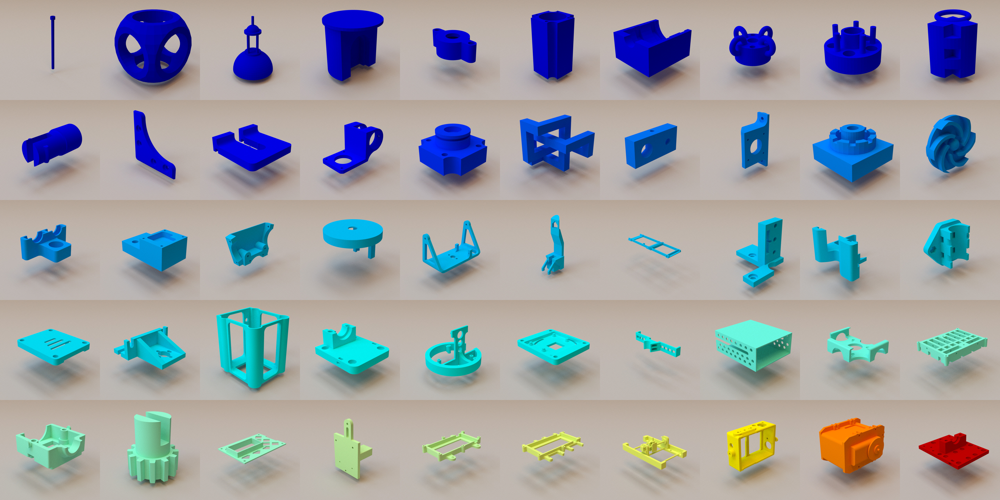

# Inverse CSG
<!-- https://github.com/<OWNER>/<REPOSITORY>/workflows/<WORKFLOW_FILE_PATH>/badge.svg -->
<!--  -->




This folder provides a snapshot of the code with the paper when it was submitted to Siggraph Asia 2018. Please refer to [this link](https://github.com/mit-gfx/InverseCSG) to check out the latest version of the code repository.

### Platform
* `Linux` (tested on `Ubuntu 14.04` and `Ubuntu 16.04`)

### Dependencies

* `C++` toolchain: `sudo apt-get install build-essential autoconf libtool flex bison mercurial zsh cmake`.
* `Python 3` (should be already preinstalled in `Ubuntu 16.04`).
* The latest `Sketch`.
* `Java >= 1.8` (needed by `Sketch`).
* `maven >= 2.2.1` (needed by `Sketch`).

### Installation
##### Automatic installation

The easiest way is to navigate to the root folder and run `python3 install.py <build_folder>`, where `build_folder` can be any folder that you have write access to. We recommend you use a `build_folder` outside the root folder. This Python script will compile the source code in `cpp/` and attempt to install any missing dependencies, which might need your `sudo` privilege.

##### Manual installation

You can also choose to do a manual installation if `install.py` fails to finish successfully.

* Run

  ```bash
  sudo apt-get install build-essential autoconf libtool flex bison mercurial zsh cmake
  ```


* Navigate to your `build_folder`, create a `cpp` subfolder, and compile the `C++` code:

  ```bash
  cd <build_folder>
  mkdir cpp
  cd cpp
  cmake <root_folder>/cpp
  make
  ```

* Follow the **Install from source** section in [this link](https://bitbucket.org/gatoatigrado/sketch-frontend/wiki/Installation) to install `Sketch`.

### Test
If the installation is successful, you can navigate to the root folder and try running:
```bash
python3 run_tests.py <build_folder> one_cube
```
This solves a simple cube. The whole process should finish within a minute. You can replace `one_cube` with other example names rerun the command. Please see `run_tests.py` for all example names.

If you want to see some quick results, you can try:
```bash
python3 run_tests.py <build_folder> ex_011
python3 run_tests.py <build_folder> ex_067
python3 run_tests.py <build_folder> ex_096
python3 run_tests.py <build_folder> ex_144
python3 run_tests.py <build_folder> ex_145
```

### Examples
The dataset of our 50 CAD models can be found in the `example` folder.

### Solutions
The solutions to all of our examples are in the `solution` folder. Each subfolder has two SCAD files: `sketch.scad` is the output of our method before simplification, and `sketch_final.scad` is the final resuls after simplification.

When you use OpenSCAD to open and render these solutions, you will notice there are a lot of degenerated planes. These planes come from a CSG intersection or difference operation that applies to two solids with same dimensions. To illustrate this point, consider subtracting a cylinder from the center of a cube that happens to have the same height, then the top and bottom circles of the cylinder can be either considered inside or outside the solution and the behavior is therefore undefined. As a result, these artifacts do not mean our solutions have an volumetric error.

